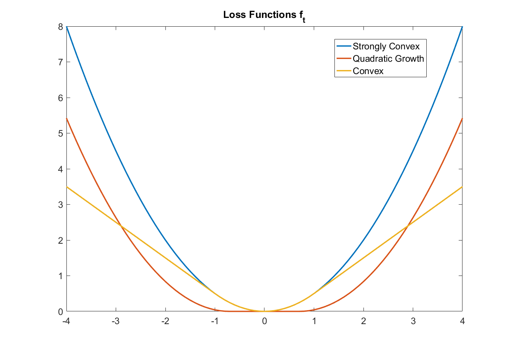

# oco_predictions
Online optimization with predictions. Simulations on the trajectory tracking problem

We consider the classical trajectory tracking problem where an agent follows a moving target in open space. We denote the location of target and agent at time $t$ by $\theta_t$ and $x_t$  respectively. The control cost for a simple dynamical system $x_{t+1} = x_{t} + u_{t}$ is considered and amounts for the stage switching cost i.e. control/energy cost $\frac{\beta}{2}\|u_t\|^2 = \frac{\beta}{2} \|x_{t+1} - x_{t}\|^2$. We define three different tracking error functions adhering to our Assumptions 1,2 and 3 respectively described in the report. 

The repository contains codes used to generate the results described in the report.
(The files also contain commented codes for generating videos, one can uncomment the required parts.)
